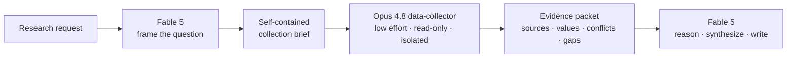

# Claude Research Router

### Keep your strongest Claude model thinking—not searching.

[](https://code.claude.com/docs/en/overview)
[](#quick-start)
[](LICENSE)

Claude Research Router gives Claude Code a clean division of labor for serious research:

- **Fable 5** stays in the main context for research design, logic, methodology, causal reasoning, synthesis, and final judgment.
- **Opus 4.8** runs in an isolated, low-effort, read-only subagent for web research, literature search, long-document reading, table extraction, metadata checks, and citation collection.

The result is a quieter reasoning context, less flagship-model retrieval work, and an evidence packet you can audit before synthesis.

> If this workflow saves your research context, consider starring the repo—it helps other researchers find it.

## Why this exists

A large research prompt quietly mixes two very different jobs:

1. **Thinking:** What is the real question? Which mechanism matters? How should conflicting evidence change the conclusion?
2. **Collecting:** Search the web, open reports, scan files, extract tables, verify dates, and compile citations.

Running both jobs in one flagship-model context is expensive and noisy. Claude Research Router separates them without requiring an external orchestration framework.



## What you get

- **Automatic routing policy** for mixed research tasks.
- **`data-collector` subagent** pinned to `claude-opus-4-8`, low effort, read-only plan mode, and a 12-turn ceiling.
- **`/collect-data` skill** for deterministic, isolated evidence collection.
- **Fail-closed guidance:** if the collector model is unavailable, do not silently spend the main reasoning model on retrieval.
- **Evidence contract:** every run reports sources, dates, units, precise locations, confidence, conflicts, and missing evidence.
- **Safe, idempotent installers** that preserve existing `CLAUDE.md` content and back up replaced files.
- **Transcript verifier** that proves which models actually ran from Claude Code's local JSONL metadata.

No MCP server. No API proxy. No Python package to install. The router is plain Claude Code configuration.

## Quick start

Clone the repository:

```bash
git clone https://github.com/Bellapk/optimize-claude-model-research.git
cd optimize-claude-model-research
```

### Windows PowerShell

```powershell
powershell -NoProfile -ExecutionPolicy Bypass -File .\install.ps1
```

### macOS, Linux, or WSL

```bash
chmod +x install.sh
./install.sh
```

The default collector is `claude-opus-4-8`. To use an alias or another available model:

```powershell
powershell -NoProfile -ExecutionPolicy Bypass -File .\install.ps1 -CollectorModel opus
```

```bash
./install.sh --collector-model opus
```

Restart Claude Code after installation, select Fable for the main research session, and check:

```text
/doctor
/memory
/skills
/agents
```

Expected results:

- `/memory` lists the global research routing policy.
- `/skills` lists `collect-data` with a **user-only** badge. That is intentional: automatic routing happens through the agent, while the slash command remains deterministic.
- `/agents` lists `data-collector` with the configured collector model and low effort.

## Use it

### Force a collection run

```text
/collect-data Collect primary USDA, Census, and exchange evidence needed to evaluate U.S. soybean basis since 2022. Record publication dates, units, revision history, exact URLs, and conflicts. Do not produce the final interpretation.
```

You can also guarantee the agent selection with:

```text
@"data-collector (agent)" Collect and verify the evidence required for...
```

### Let Claude route a mixed task

```text
Develop a research framework for forecasting U.S. soybean FOB basis.
Delegate source collection and dataset verification to data-collector.
Use the main model only for methodology, causal reasoning, and synthesis.
```

The collector returns a compact packet:

```text
Collection status
Requirement and scope
Sources examined
Evidence collected
Conflicts and limitations
Missing evidence
Recommended next collection step
```

## Verify the model split

Do not rely on the spinner or the main `/status` display. Inspect the actual transcript metadata:

```powershell
py scripts\verify_routing.py --project "D:\path\to\your\research-project"
```

```bash
python3 scripts/verify_routing.py --project /path/to/your/research-project
```

A successful check prints:

```text
PASS: claude-fable-5 handled the main session and claude-opus-4-8 handled data collection.
```

In a real end-to-end test of this configuration, the verifier reported **327 Fable 5 main-session messages** and **38 Opus 4.8 collector messages**. That proves routing worked; it is not a universal cost-savings benchmark.

## Why three components?

| Component | Responsibility |
|---|---|
| Global routing policy | Tells the main model which work to keep and which work to delegate |
| `data-collector` agent | Controls model, effort, permissions, turn limit, and evidence format |
| `/collect-data` skill | Provides a deterministic manual entry point in an isolated context |

A Skill alone is not a reliable automatic router. An Agent alone does not give you a convenient slash command. The policy, agent, and skill work together.

## Safety and cost controls

- `permissionMode: plan` keeps the collector read-only under normal permission settings.
- `Write`, `Edit`, `NotebookEdit`, nested `Agent`, and additional `Skill` calls are denied.
- `maxTurns: 12` bounds a single collection run.
- Only one collector should run at a time unless you explicitly choose speed over usage.
- Existing global configuration files are backed up under `~/.claude/backups/optimize-claude-model-research/`.
- The installer never changes your default main model or `settings.json`.

Check `CLAUDE_CODE_SUBAGENT_MODEL`: when set to a model other than `inherit`, it overrides the agent's frontmatter model.

## What this does not promise

- **Automatic delegation is behavioral, not a billing firewall.** Use `/collect-data` or an agent mention when routing must be deterministic.
- **Model availability depends on your Claude plan and provider.** Use `opus` when the exact model ID is unavailable.
- **Savings vary by workflow.** Measure with `/usage` and the transcript verifier instead of trusting a headline percentage.
- **Parent permission modes can take precedence.** Review your Claude Code permission configuration before handling sensitive repositories.

## Remove it

Remove these two installed files:

```text
~/.claude/agents/data-collector.md
~/.claude/skills/collect-data/SKILL.md
```

Then delete the bounded block between these markers in `~/.claude/CLAUDE.md`:

```text
<!-- BEGIN optimize-claude-model-research -->
<!-- END optimize-claude-model-research -->
```

## Project structure

```text
.
├── .claude/
│   ├── agents/data-collector.md
│   └── skills/collect-data/SKILL.md
├── scripts/verify_routing.py
├── templates/research-model-routing.md
├── tests/test_package.py
├── install.ps1
└── install.sh
```

## Contributing

Ideas and pull requests are welcome, especially for:

- a Haiku source-scout tier for mechanical first-pass retrieval;
- provider-specific model presets for Bedrock, Vertex, and Foundry;
- usage dashboards built from transcript metadata;
- additional evidence-packet schemas for scientific and policy research.

Run the zero-dependency test suite before opening a PR:

```bash
python -m unittest discover -s tests -v
```

## References

- [Claude Code custom subagents](https://code.claude.com/docs/en/sub-agents)
- [Claude Code skills](https://code.claude.com/docs/en/slash-commands)
- [Claude Code model configuration](https://code.claude.com/docs/en/model-config)
- [Claude Code cost management](https://code.claude.com/docs/en/costs)

MIT licensed. Built for researchers who want the best model on the hardest part of the work.
