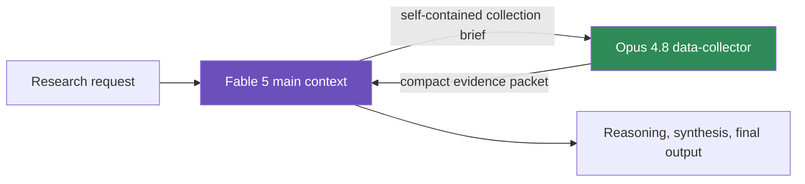

<div align="center">

# Claude Research Router

### Keep your strongest model thinking — not searching.

[](https://code.claude.com/docs)
[](#quick-start)
[](#quick-start)
[](LICENSE)

**A capability-based model router for serious research in Claude Code.**

Use **Fable 5** for research design, methodology, reasoning, synthesis, and final judgment. Route literature search, source discovery, long-document reading, table extraction, metadata checks, and citation collection to a read-only **Opus 4.8** subagent.

If this keeps your best model focused on the work that actually needs it, consider giving the project a star.

</div>

---

## The problem

A single research request often mixes two very different workloads:

| Workload | What it needs | What goes wrong in one context |
|---|---|---|
| Research design and synthesis | Deep reasoning and judgment | The expensive model should spend its budget here |
| Search, reading, and extraction | Reliable retrieval and provenance | Long tool output pollutes the reasoning context |

Running everything through the flagship model wastes context on search results, report text, file scans, and repetitive metadata checks. Switching the entire session to a cheaper model saves usage, but weakens the part of the workflow where quality matters most.

**Claude Research Router separates the two.**



The collector gets its own context window. The main thread receives structured evidence instead of every search result and document excerpt.

## What you get

- **Automatic research routing** through a concise global `CLAUDE.md` policy.
- **A dedicated `data-collector` subagent** pinned to `claude-opus-4-8` with `low` effort.
- **A deterministic `/collect-data` command** for manual evidence collection.
- **Read-only operation** with file editing, nested agents, and extra Skill loading disabled.
- **A fixed evidence contract** covering provenance, dates, units, definitions, conflicts, missing evidence, and confidence.
- **Fail-closed instructions** when the configured collector model is unavailable.
- **Safe, idempotent installers** that back up conflicting files and preserve existing `CLAUDE.md` content.
- **A transcript verifier** that proves which models actually ran without printing prompts or responses.
- **No runtime dependencies** beyond Claude Code and standard PowerShell/Bash. The verifier uses Python's standard library only.

## Real-session proof

This configuration was smoke-tested on a live research project. The verifier inspected Claude Code's JSONL metadata:

| Context | Actual model | Assistant messages |
|---|---:|---:|
| Main research thread | `claude-fable-5` | 345 |
| `data-collector` subagent | `claude-opus-4-8` | 38 |

The main transcript recorded:

```text
AGENT_CALL=data-collector
MODEL_OVERRIDE=<frontmatter>
DESCRIPTION=Close three evidence gaps
```

This proves that routing happened. It is **not** a universal cost-savings benchmark; usage depends on your sources, prompts, plan, and provider.

## Quick start

### 1. Clone

```bash
git clone https://github.com/Bellapk/optimize-claude-model-research.git
cd optimize-claude-model-research
```

### 2. Install globally

Windows PowerShell:

```powershell
powershell -ExecutionPolicy Bypass -File .\install.ps1
```

macOS, Linux, or WSL:

```bash
chmod +x install.sh
./install.sh
```

The installer adds:

```text
~/.claude/
├── CLAUDE.md
├── agents/
│   └── data-collector.md
└── skills/
    └── collect-data/
        └── SKILL.md
```

Existing conflicting files are backed up under:

```text
~/.claude/backups/optimize-claude-model-research/<timestamp>/
```

The installer does not change your default session model or `settings.json`.

### 3. Restart and check

Restart Claude Code, then run:

```text
/doctor
/memory
/skills
/agents
```

Expected results:

- `/memory` lists the user-level `CLAUDE.md` policy.
- `/skills` lists `collect-data` with a **user-only** badge. That is intentional.
- `/agents` lists `data-collector` with Opus 4.8, low effort, plan permission mode, and a 12-turn limit.
- `/doctor` reports no schema or configuration errors.

## Use it

### Deterministic collection

```text
/collect-data Collect USDA, CONAB, NOAA, and CME evidence needed to evaluate
Brazilian soybean production revisions and US soybean basis from 2022-present.
Record publication dates, units, revision history, exact URLs, and conflicts.
```

The command always runs in an isolated collector context.

### Guaranteed agent invocation

Type `@` and select `data-collector (agent)`, or use:

```text
@agent-data-collector Collect and verify the primary sources for this claim.
```

### Automatic routing

Give the main Fable session a mixed research task:

```text
Develop a framework for forecasting US soybean FOB basis.
Delegate all source collection and dataset verification to data-collector.
Use the main context only for research design, methodology, and synthesis.
```

The main thread creates a narrow collection brief, delegates it, and reasons over the returned evidence packet.

## Evidence packet contract

Every collection returns the same structure:

```text
## Collection status
## Requirement and scope
## Sources examined
## Evidence collected
## Conflicts and limitations
## Missing evidence
## Recommended next collection step
```

Each material finding must include its value, unit, applicable period, definition, direct source location, and confidence level. Missing evidence is reported, never invented.

## Verify the models that actually ran

UI labels are useful, but transcript metadata is definitive.

Windows:

```powershell
py scripts\verify_routing.py --project "D:\path\to\your-research-project"
```

macOS, Linux, or WSL:

```bash
python3 scripts/verify_routing.py --project /path/to/your-research-project
```

Example result:

```text
Main: claude-fable-5 (345 messages)
Agent calls:
  - data-collector | model=<frontmatter> | actual=agent-....jsonl:
    claude-opus-4-8 (38 messages) | Close three evidence gaps
Subagent transcripts:
  - agent-....jsonl: claude-opus-4-8 (38 messages)

PASS: reasoning and evidence collection used the configured model split.
```

The verifier reads model metadata, agent type, description, timestamps, and the Agent result ID only. It never prints prompts, collected evidence, or final responses. A run passes only when the `data-collector` call links to a transcript that actually used the expected collector model.

## Customize the collector model

Opus 4.8 is the default. You can install with another full model ID or a Claude Code model alias:

Windows:

```powershell
.\install.ps1 -CollectorModel opus
```

macOS, Linux, or WSL:

```bash
./install.sh --collector-model opus
```

To preview installation without writing files:

```powershell
.\install.ps1 -DryRun
```

```bash
./install.sh --dry-run
```

The `CLAUDE_CODE_SUBAGENT_MODEL` environment variable has higher priority than the agent's frontmatter. The installers warn when they detect a conflicting value.

## Why all three pieces are necessary

| Component | Responsibility |
|---|---|
| `CLAUDE.md` policy | Teaches the main model when to delegate and prevents duplicate searches |
| `data-collector` agent | Controls model, effort, permissions, turn limit, and evidence format |
| `/collect-data` Skill | Provides a predictable manual entry point with isolated context |

A Skill alone is not a reliable automatic router. An agent alone does not define how the main research process should divide mixed tasks. The policy, agent, and Skill form one small routing layer.

### Why not just use `opusplan`?

`opusplan` switches models by Claude Code mode: Opus while planning, then Sonnet during execution. This project routes by **research capability** instead. Evidence collection gets an isolated, read-only context and a structured return contract, while the Fable thread keeps responsibility for reasoning and synthesis. The two approaches solve different problems.

## Safety and usage controls

- The collector runs with `permissionMode: plan`.
- `Write`, `Edit`, `NotebookEdit`, `Agent`, and `Skill` are denied.
- Collection stops after 12 agentic turns.
- One collector runs at a time by default; parallel collectors multiply token usage.
- The main context does not repeat searches already represented in the evidence packet.
- The main session model remains your choice; select Fable 5 before starting the research task.

Claude Code permission modes can be affected by a parent session running with elevated permission settings. Review your own permission configuration before using any agent on sensitive repositories.

## Compatibility

Use Claude Code **v2.1.170 or newer**. Fable 5 requires v2.1.170, while Opus 4.8 requires v2.1.154. Run `claude update` before installation if either model is missing from your picker.

The project relies on current Claude Code support for:

- custom [subagents](https://code.claude.com/docs/en/sub-agents),
- [Skills](https://code.claude.com/docs/en/slash-commands) with `context: fork`,
- per-agent and per-Skill [model and effort configuration](https://code.claude.com/docs/en/model-config).

Model availability depends on your Claude plan, organization allowlist, API provider, and Claude Code version.

## Repository layout

```text
.
├── .claude/
│   ├── agents/data-collector.md
│   └── skills/collect-data/SKILL.md
├── templates/research-model-routing.md
├── scripts/verify_routing.py
├── tests/test_package.py
├── install.ps1
├── install.sh
└── LICENSE
```

## Run the package tests

```bash
python -m unittest discover -s tests -v
```

The tests validate model pinning, effort, permission mode, turn limits, denied tools, the evidence packet schema, the forked Skill configuration, and installer presence.

## Roadmap

- [ ] Optional Haiku source-scout tier for mechanical searches
- [ ] Provider presets for Anthropic API, Bedrock, Vertex AI, and Foundry
- [ ] Session-level usage summaries by model
- [ ] Domain evidence profiles for academic, policy, financial, and commodity research
- [ ] Reusable evaluation prompts for routing quality

Ideas and pull requests are welcome. If you test the router on a real workflow, open an issue with the task shape, provider, model split, and what improved or failed. Please do not include private transcript content.

## GitHub About description

> Route Claude Code research intelligently: Fable 5 for reasoning, Opus 4.8 for evidence collection — with a read-only agent, `/collect-data` Skill, safe installers, and transcript-level proof.

Suggested topics:

`claude-code` · `research` · `model-routing` · `subagents` · `agent-skills` · `llm` · `ai-agents` · `token-optimization` · `prompt-engineering` · `context-engineering`

## License

[MIT](LICENSE) © 2026 Bellapk
